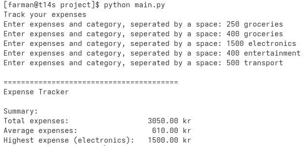

## Week 1 Project

The program asks for 5 expenses and its respective category from the user. It stores this information as a list in a list. So each entry in the list stores an *expense* which contains an amount and a category.

The program processes the input to calculate total amount spent, the average amount of each expense and the highest expense. It then outputs everything in a nicely fashion.

There is a main function which controls execution. Besides that there are two functions which the program comprises of. One which gets user input and returns a list of expenses and one which outputs this list as a summary. The *print_summary* function which accepts expenses as a parameter calls other functions which are needed to create this summary. I.e. *total_expenses*, *avg_expenses* and *get_highest_expense*.

### Example usage

